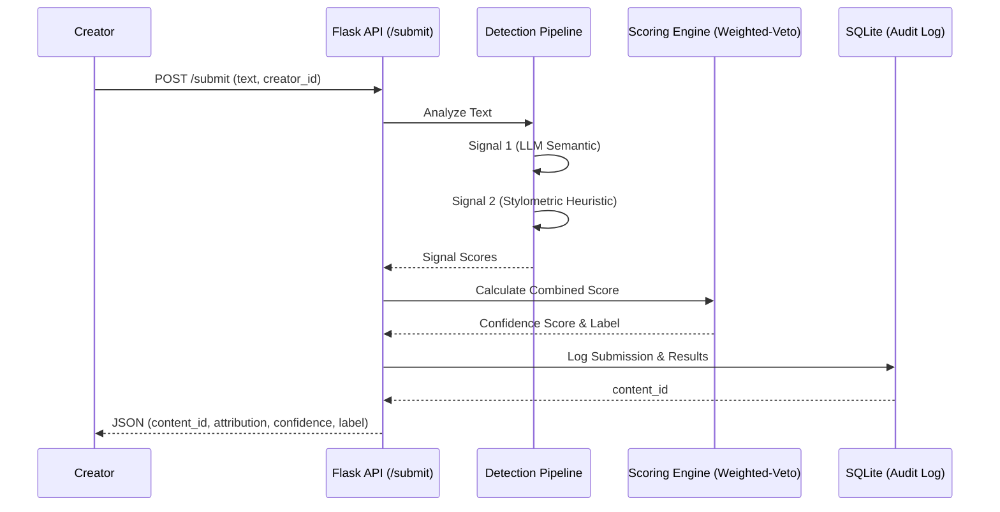
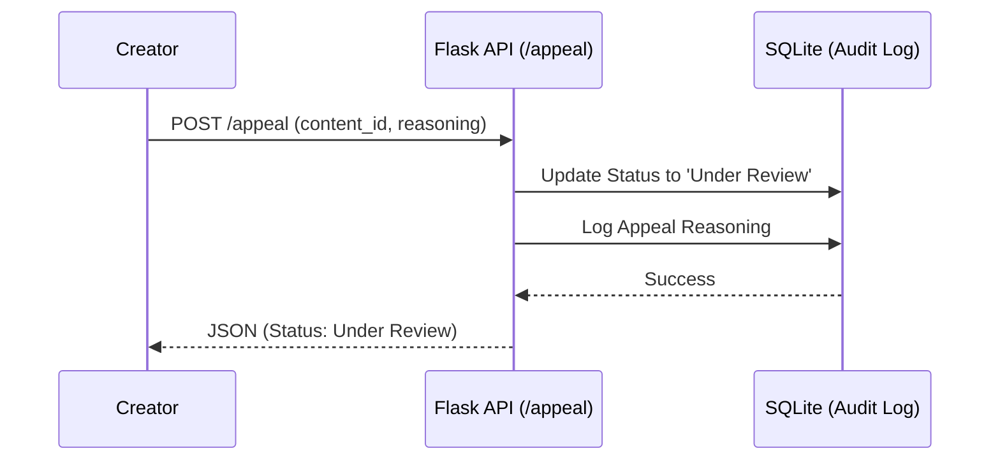

# Architecture: Provenance Guard

Provenance Guard is designed as a deep classification system for content attribution. It prioritizes avoiding false positives through a multi-signal pipeline and a Weighted-Veto scoring engine.

## Submission Flow

The submission flow transforms raw text into a classified content entry with a transparency label and a confidence score.

## Appeal Flow

The appeal flow allows creators to contest classifications, updating the state and providing an audit trail for review.

## Deep Module: Scoring Engine

The `ScoringEngine` is a deep module that hides the complexity of multi-signal reconciliation.

- **Interface**: `calculate_score(signals: Dict[str, float]) -> Tuple[str, float, str]`
- **Implementation**: Implements the "Weighted-Veto" logic where high-confidence human signals can override AI-leaning signals to minimize false positives.

## Data Seams

- **API Seam**: The boundary between the Flask routes and the core logic.
- **Signal Seam**: The boundary between the pipeline and individual detection modules (LLM, Stylometrics).
- **Storage Seam**: The boundary between the application and the SQLite database.
