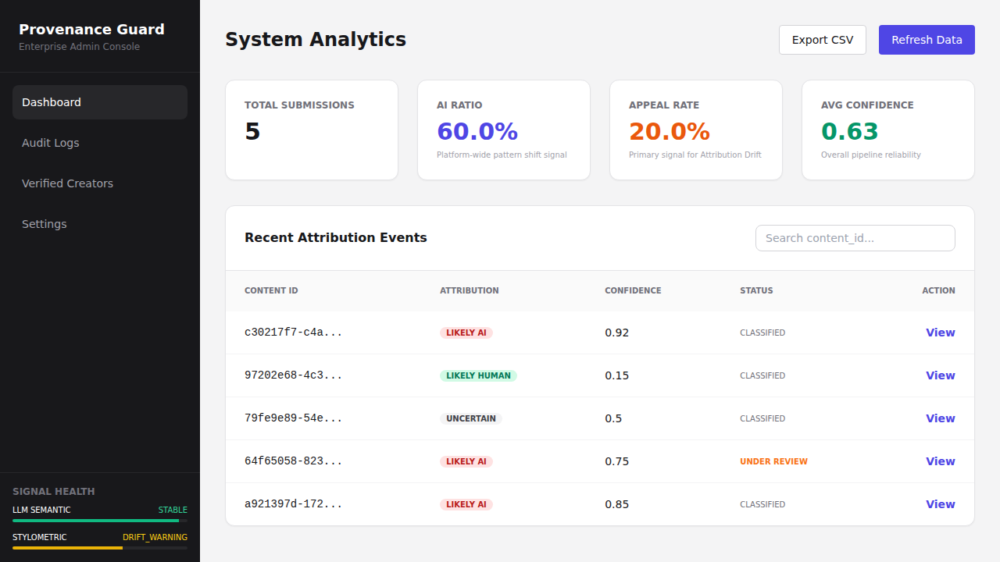

# ai201-project4-provenance-guard

Provenance Guard is a backend classification system designed for social writing platforms (e.g., Medium, Substack) to provide transparency about content origin while protecting human creators from false positives.

## Architecture

The system follows a multi-signal pipeline with a **Weighted-Veto Scoring Engine**.

1.  **Submission Flow**: `POST /submit` accepts text, runs it through LLM-based and Stylometric analysis, calculates a confidence score, and logs the result to a **SQLite** audit log.
2.  **Appeal Flow**: `POST /appeal` allows creators to contest labels. This updates the content status to `under_review` and changes the transparency label for readers.
3.  **Security**: The `/log` endpoint is protected by a simulated admin API key.
4.  **Resilience**: Rate limiting (10 requests per minute) prevents system abuse.

## Detection Signals

### 1. LLM-based Semantic Analysis (Groq Llama 3.3 70B)
- **Measures**: Linguistic patterns, structural rigidity, and semantic coherence common in AI output.
- **Strength**: High sensitivity to typical LLM instruction-following styles.
- **Blind Spot**: Can misclassify highly formal or academic human writing.

### 2. Stylometric Heuristics (Python)
- **Measures**: Sentence length variance, Type-Token Ratio (vocabulary diversity), Punctuation Density, and Average Sentence Complexity.
- **Strength**: Captures the inherent variability and "burstiness" of human thought.
- **Blind Spot**: Short or casual human writing can appear statistically uniform.

## Confidence Scoring: Weighted-Veto Model

The scoring engine prioritizes avoiding false positives (labeling humans as AI).
- **Logic**: If the Stylometric Human score is very high (>0.85), it "vetos" or significantly reduces any AI markers found by the LLM.
- **Validation**: Tested against formal academic writing (which LLMs often flag) to ensure the stylometric signal pulls the score back into the "Uncertain" or "Human" tier.

## Transparency Labels (Objective & Neutral)

| Variant | Exact Text |
| :--- | :--- |
| **High-Confidence Human** | "Human-Authored: This content displays the stylistic variability characteristic of human writing." |
| **Uncertain** | "Attribution Neutral: Our analysis found mixed signals regarding the origin of this content." |
| **High-Confidence AI** | "AI-Generated: This content matches patterns consistently associated with large language model output." |
| **Under Review** | "Humanity Verification in Progress (Under Review): A creator has contested the automated label." |

### Provenance Certificate (Verified Creator)
| Variant | Exact Text |
| :--- | :--- |
| **Verified Human** | "Verified Provenance: Human-Authored: This content displays the stylistic variability characteristic of human writing." |
| **Verified Uncertain** | "Verified Provenance: Attribution Neutral: Our analysis found mixed signals regarding the origin of this content." |
| **Verified AI** | "Verified Provenance: AI-Generated: This content matches patterns consistently associated with large language model output." |

> **Mockup**: The "Verified Provenance" status is a high-trust credential displayed as a prefix to the standard transparency label. It indicates the creator has undergone a one-time identity verification step.

## Rate Limiting

- **Limit**: 10 requests per minute per IP.
- **Reasoning**: This accommodates typical human writing patterns (one post every few minutes) while blocking scripts or automated tools from flooding the attribution engine.

## Known Limitations

- **Short Text**: Submissions under 100 words provide insufficient data for stylometric signals, often leading to "Uncertain" classifications.
- **Highly Edited AI**: Lightly edited AI text can bypass stylometric checks while retaining enough semantic markers to be "Uncertain," which reflects genuine system ambiguity.
- **Abstract Alt-text**: Extremely short or abstract human-written Alt-text may lack enough subjective markers, potentially being flagged as "Uncertain" if it inadvertently matches a common AI template.

## Multi-Modal Support: Image Descriptions (Alt-text)

Provenance Guard extends its transparency mission to accessibility by supporting **Image Descriptions (Alt-text)**. This allows platforms to verify that descriptive content for images is genuine and high-quality.

### Detection Signals for Alt-text
1. **Template Conformity**: Detects formulaic patterns typical of AI generators (e.g., starting with "A photo of..." or "An image showing..."). AI often uses clinical, predictable structures for descriptions.
2. **Descriptive Verbosity**: Measures the "clinical exhaustiveness" of the description. AI-generated Alt-text is often overly detailed and lacks the subjective focus typically found in human-authored descriptions.
3. **LLM Semantic Analysis**: Real-time evaluation via Groq to identify linguistic patterns specific to AI-generated descriptive content.

## Spec Reflection

- **Spec Alignment**: The implementation followed the vertical slices defined in `planning.md` precisely.
- **Divergence**: During implementation of the `ScoringEngine`, I moved the Veto threshold from 0.9 (initial design) to 0.85 after realizing that formal academic human writing was hovering around 0.8 on stylometrics, requiring a slightly lower threshold to trigger the "Human Defense."

## AI Usage

1.  **Skeleton Generation**: Used AI to generate the initial Flask app and SQLite table structure based on `ARCHITECTURE.md`. I revised the `audit_log` table to include `stylo_score` and `llm_score` separately for deeper transparency.
2.  **Scoring Logic**: Used AI to draft the stylometric metric functions. I overrode the weighting (increasing Sentence Length Variance to 40%) after testing revealed it was the most reliable differentiator for human "burstiness."

## Analytics Dashboard (Admin Leverage)

The Provenance Guard dashboard provides platform administrators with high-level **Leverage** to maintain content integrity:

1.  **AI vs. Human Ratio**: Provides leverage for content moderation strategies and resource allocation. It allows admins to detect platform-wide pattern shifts and adjust moderation priorities.
2.  **Appeal Rate**: Acts as a "Human-in-the-loop" feedback signal. High rates indicate that the **Weighted-Veto** thresholds may be too aggressive, providing the leverage to recalibrate signals and protect genuine human creators.
3.  **Average Confidence**: Provides leverage by indicating the health of the detection pipeline. A drop in average confidence suggests that the pipeline needs an **Ensemble Detection** upgrade (e.g., adding a third signal) to handle new types of ambiguous content.

## Setup

1.  Install dependencies: `pip install -r requirements.txt`
2.  Initialize DB: `python init_db.py`
3.  Set `GROQ_API_KEY` in `.env`.
4.  Run app: `python app.py`
